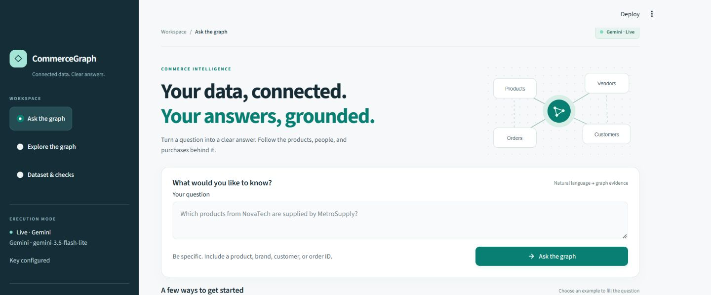
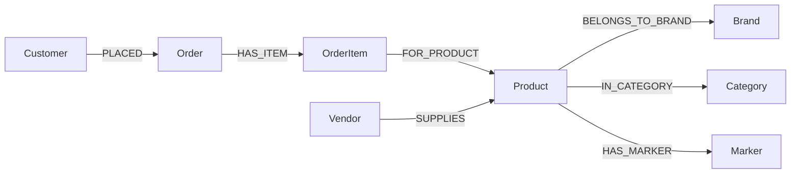

# CommerceGraph

**Ask your commerce data. Inspect every answer.**

A local Python application that turns standalone e-commerce questions into
validated graph traversals, retrieves supporting records, and presents grounded
answers. Gemini is the only LLM provider. The same service powers the CLI and UI.

## Current verification status

The offline application is implemented. The dataset, graph, all seven query
operations, evidence rendering, provider error handling, exports, and UI behavior
have offline tests. See [the validation record](docs/validation.md) for actual checks.

**120 offline tests pass; all 14 questions have verified real Gemini captures.**
The final full batch passed 13 of 14; the remaining marker case passed after its
output contract was clarified. The [live report](examples/sample_results.md) is
a transparent capture collection across those attempts, with original timestamps
and prompt versions. Earlier model-demand, rate-limit and interpretation failures
are retained. The [recorded walkthrough](https://www.loom.com/share/a3fc7067bfaa4519a380160b32d5aa2a)
demonstrates the project.

## What you can do

- Filter products across brand, vendor, category, and current catalog price.
- Find product suppliers, customer orders, and historical order totals.
- Follow customer → order → item → product → brand purchase relationships.
- Count distinct catalog products per vendor; retrieve or count graph markers.
- Inspect raw/resolved query plans, supporting nodes and typed edge paths.
- Explore the graph and download records, execution evidence, source JSON, or graph JSON.



The interface now includes a dark navigation rail, a teal visual theme, an illustrated
question workspace, readable answer cards, order-total summaries, and responsive
graph controls. After a query, the header becomes compact and examples collapse
to keep the answer in focus. See the [desktop answer](docs/screenshots/polished-result-1440.png)
and [phone layout](docs/screenshots/polished-ask-390.png).

The dataset is synthetic. This is a bounded question interface: stock, ratings,
shipping, taxes, actual transaction seller, vendor revenue, date ranges, rankings,
recommendations, and external facts are unavailable. Each question stands alone;
history is for reviewing previous results, not conversation memory.

## Requirement-to-feature mapping

| Requirement | Implementation and verification |
|---|---|
| Six core entity types with typed directed links | Validated synthetic JSON and NetworkX graph; source/graph tests |
| Exact five marker occurrences | Recursive runtime audit and adversarial four/six occurrence tests |
| Natural-language graph retrieval | Gemini QueryPlan, exact entity resolution, seven allowlisted traversals |
| Grounded answers through two LLM stages | Gemini AnswerPlan references, complete-reference validation, Python factual rendering |
| Historical totals and delivered purchases | OrderItem prices/quantities and delivered-only paths; independent expected cases |
| Three usable views with evidence and exports | Streamlit question, explorer and dataset views; browser and AppTest checks |
| Real sample captures | All 14 independently checked captures with source-report provenance |
| Reproducible setup and delivery | Locked dependencies, clean environment verification, secret-free review ZIP |
| Personal walkthrough | Recorded Loom video linked below |

## Setup

Tested interpreter: Python **3.12.0 on Windows**. The exact dependency versions are
in [requirements.lock.txt](requirements.lock.txt). Use the environment executable
directly; activation or execution-policy changes are unnecessary.

Windows PowerShell, from the project root:

```powershell
python -m venv .venv
.\.venv\Scripts\python.exe -m pip install -r requirements.lock.txt
.\.venv\Scripts\python.exe -m pip install --no-deps -e .
Copy-Item .env.example .env
```

If .env already exists, keep it and edit it instead of overwriting it.
For developing with dependency resolution rather than the existing lock:

```powershell
.\.venv\Scripts\python.exe -m pip install -e ".[dev]"
```

macOS/Linux equivalents (not verified on those platforms):

```bash
python3.12 -m venv .venv
.venv/bin/python -m pip install -r requirements.lock.txt
.venv/bin/python -m pip install --no-deps -e .
cp .env.example .env
```

The source uses a src-layout package. Install it before running the app. The default
dataset and example definitions are packaged, so CLI retrieval does not depend on
an arbitrary working directory. Run UI/setup commands from the root to load its
theme and local .env. Custom dataset paths are supported with COMMERCEGRAPH_DATASET.

## Configure Gemini

Create your own key in [Google AI Studio](https://aistudio.google.com/apikey) and
save it only in local .env:

```dotenv
GEMINI_API_KEY=your_local_key
GEMINI_MODEL=gemini-3.5-flash-lite
APP_MODE=live
COMMERCEGRAPH_DATASET=
GEMINI_TLS12=0
```

The model is configurable; choose a structured-output model your account can
access. Google's [pricing](https://ai.google.dev/gemini-api/docs/pricing) currently
lists free-tier access for selected models, with account-specific
[rate limits](https://ai.google.dev/gemini-api/docs/rate-limits). A key is not a
guarantee of unlimited free usage. The app does not enable billing, tools, web
grounding, or another provider. It uses Google's official `google-genai` SDK.

The app rereads .env on refresh. Explicit process environment variables take
precedence. A configured key is labeled **Key configured** until a request succeeds.
Missing keys leave graph exploration available and disable live question submission.

On this Windows network, Python's default TLS handshake failed before reaching
Google. Setting `GEMINI_TLS12=1` in local .env resolved it. This optional setting
uses TLS 1.2 with certificate and hostname verification enabled. Leave it at `0`
on networks where normal TLS negotiation works. The diagnostic command
`python scripts/check_gemini.py --tls12` checks a small structured request.

## Run the application

```powershell
.\.venv\Scripts\python.exe -m commercegraph validate
.\.venv\Scripts\python.exe -m streamlit run app.py --server.address 127.0.0.1
.\.venv\Scripts\python.exe -m commercegraph ask "Which products from NovaTech are supplied by MetroSupply?"
```

Open http://127.0.0.1:8501. Select **Ask the graph**, **Explore the graph**, or
**Dataset & checks**. Example buttons fill the input; the submit button runs the
pipeline. Filters, navigation, history, and downloads do not repeat LLM calls.

For an explicitly labeled offline demonstration:

```powershell
$env:APP_MODE = "offline"
.\.venv\Scripts\python.exe -m streamlit run app.py --server.address 127.0.0.1
```

Offline mode accepts only exact predefined example
questions. It uses independently chosen fixture plans and real graph retrieval;
it is not a substitute for Gemini inference. To return to .env settings, remove
the process override with `Remove-Item Env:APP_MODE` or use a new terminal.

## Graph and data semantics

The fixed fixture has **58 nodes and 83 directed edges**: 12 products, 4 brands,
4 categories, 3 vendors, 6 customers, 8 orders, 16 order items, and 5 markers.
The source JSON lives in data/ecommerce.json, with an identical packaged copy.
`scripts/create_seed.py` reproduces both from the fixed canonical sample records.



NetworkX keeps the graph in memory; JSON is the persisted source. Namespaced keys
prevent collisions. Separate OrderItem nodes preserve repeated purchase lines,
quantities, and historical unit prices. Catalog SUPPLIES relationships identify
potential suppliers, not which vendor fulfilled an order.

Money is stored as integer paise. Historical merchandise totals are the sum of
quantity × purchase unit price, excluding tax and shipping. O01 totals INR 5,397.00
using INR 3,899.00 and two units at INR 749.00, rather than current catalog prices.
"Bought" includes delivered orders only. "Orders" includes all statuses unless
filtered. Cancelled orders have calculable totals but are not completed revenue.

## Supported query language

| Operation | Supported parameters |
|---|---|
| find_products | brand, vendor, category, strict upper price; list/count; at least one filter |
| vendors_for_product | product |
| orders_for_customer | customer; optional delivered/pending/cancelled status |
| order_details | order ID |
| customers_bought_brand | brand; delivered orders only |
| vendor_product_counts | none; includes vendors with zero products |
| lookup_value | marker text value; list/count |

Filters use AND semantics and stable ID ordering. "Under/below" uses strict `<`.
Inclusive "at most", minimum prices, sorting/rankings, and unsupported modifiers
must be declined rather than silently ignored. Entity IDs match exactly; canonical
names match after trimming, whitespace collapse, and case folding. Unknown names
are not replaced with similar known entities.

Illustrative planner output (not a live capture):

```json
{
  "decision": "query",
  "operation": "find_products",
  "parameters": {
    "brand_name": "NovaTech", "vendor_name": "MetroSupply",
    "category_name": null, "customer_name": null, "product_name": null,
    "order_id": null, "price_lt_inr": null, "value": null,
    "output_mode": "list", "order_status": null
  },
  "clarification_code": null,
  "unsupported_code": null
}
```

Resolved executable plan:

```json
{"operation": "find_products", "brand_id": "B01", "vendor_id": "V01", "output_mode": "list"}
```

Python validates the operation's required and forbidden fields, resolves entities,
and dispatches to trusted traversal functions. Generated code is never executed.

## Answer grounding and failures

Gemini stage one proposes the QueryPlan. Python retrieves actual graph evidence
and calculates aggregates. Gemini stage two proposes an AnswerPlan containing
only a template ID, evidence record IDs, and aggregate keys. The validator requires
the complete retrieved record set and known aggregates. Python then fills every
factual value into fixed sentences and tables.

This constrains displayed facts; it does not prove correct intent interpretation,
real-world data truth, or graph completeness. Inspect the interpreted filters.
See [architecture.md](docs/architecture.md) and Google's
[structured-output documentation](https://ai.google.dev/gemini-api/docs/structured-output).

| State | Behavior |
|---|---|
| ok | Records and supporting evidence; count zero is valid |
| no_data | Valid query/entities with no matching list results |
| entity_not_found | Explain the missing entity |
| clarification_required | Ask for a named entity or complete constraint |
| unsupported | Explain the bounded scope |
| llm_unavailable | Missing key, access, quota, connection, refusal, or incomplete response |
| invalid_plan | Reject contract-invalid interpretation before retrieval |
| dataset_error | Block startup when source or graph integrity fails |

If stage two fails, an evidence-based deterministic fallback is labeled explicitly.
If stage one fails, no fake live interpretation or answer is produced. Provider
exception strings and API keys are never included in exported diagnostics.

## Exactly five marker occurrences

Five distinct Marker nodes store the word `banana` exactly once in their value
attributes. The runtime audit checks both the matching-node count and a recursive,
case-insensitive whole-word scan (`\bbanana\b`) of graph metadata, node keys,
node attribute keys/values, and edge attribute keys/values. Dictionary, list, and
tuple nesting is scanned. Repeated endpoint IDs in graph exports are not counted
as additional logical graph values. Substrings such as `bananas` do not match.

The restriction applies to the runtime graph, not README, code, UI history, or
reports. Counts are computed, not hardcoded into query answers. Visualization
does not write labels back into the graph. A failed audit blocks startup.
Marker questions go through the same planned lookup operation as other questions.

## Examples and real reports

The following facts were retrieved during the actual **offline fixture** run:

| Question | Retrieved facts |
|---|---|
| NovaTech products supplied by MetroSupply? | P01, P02, P03 |
| Vendors supplying Portable Speaker? | MetroSupply and EverydayWholesale |
| Outdoors products under INR 1500? | Insulated Bottle INR 799.00; Camping Lantern INR 1299.00 |
| Asha Mehta's orders? | O01 INR 5,397.00; O04 INR 2,096.00 |
| Merchandise total for O01? | INR 5,397.00 with L01/L02 evidence |
| Customers who bought NovaTech? | Asha Mehta, Neha Rao, Kabir Sen; delivered only |
| Distinct products per vendor? | V01: 5; V02: 4; V03: 5 |
| Matching graph markers? | M01–M05 linked to P01, P04, P07, P10, P12 |
| How many matching markers? | 5, computed from retrieved records |

Full [offline execution report](examples/offline_results.md) and
[machine-readable evidence](examples/offline_results.json) are separate from
[independent expected fixtures](tests/fixtures/expected_cases.json).

Generate and verify real Gemini submission captures with:

```powershell
.\.venv\Scripts\python.exe -m commercegraph export-examples --mode live --interval-seconds 15
```

This executes all 14 questions, checks interpreted intent and expected facts,
and requires both real Gemini stages for successful retrieval examples. On
success it writes examples/sample_results.json and .md. On failure it writes
examples/live_failures.json and preserves any existing successful report.
A [failed real run](examples/live_attempt_03.json) is preserved for review, together
with earlier attempts. [Verified real captures](examples/sample_results.json) cover
all 14 questions: 13 from the final full batch and Q08 from its corrected targeted
rerun. This is explicitly a collection across attempts, not a claim that one
uninterrupted batch passed every question. Each run preserves its capture source.
To reproduce the collection from the retained actual reports:

```powershell
.\.venv\Scripts\python.exe scripts/collect_verified_captures.py examples/live_attempt_03.json examples/targeted_marker_results.json
```

The reports include actual timestamps, model, dataset hash, plans, evidence,
statuses, measured durations, and token usage when returned by the provider.

## Tests and fresh-install verification

```powershell
.\.venv\Scripts\python.exe -m pytest -m "not live"
.\.venv\Scripts\python.exe -m ruff check .
.\.venv\Scripts\python.exe -m ruff format --check .
.\.venv\Scripts\python.exe -m commercegraph export-examples --mode offline
```

Live tests are explicitly opt-in and consume API quota:

```powershell
$env:RUN_LIVE_TESTS = "1"
.\.venv\Scripts\python.exe -m pytest -m live
```

Live tests preserve the configured TLS/model/key settings and always use the
packaged assignment fixture. They pause 15 seconds between questions by default;
`LIVE_TEST_INTERVAL_SECONDS` can override that interval between 0 and 60 seconds.
The export command is the alternative for saving actual execution reports.

For a fresh environment, follow the Setup instructions in a new project copy,
then run the validation and offline test commands above.

Testing covers invalid fixtures, graph schema/cardinality, recursive marker scans,
exact money, strict price boundaries, supplier deduplication, repeated purchase
lines, delivered-only purchases, resolution failures, malicious operation names,
invented/omitted/duplicate answer references, API failures, plain-text rendering,
exports, and explicit UI submission without repeat inference on navigation.
Only actual completed checks are recorded in docs/validation.md.

Create a source review archive:

```powershell
.\.venv\Scripts\python.exe scripts/package_submission.py
```

This packages an explicit source/docs/report allowlist into
`dist/CommerceGraph-review.zip`, excluding .env, environments and caches. It blocks
packaging if a selected file contains the locally configured key.

## Troubleshooting

| Problem | Action |
|---|---|
| Missing Gemini key | Save GEMINI_API_KEY in local .env; refresh configuration |
| Model unavailable | Set GEMINI_MODEL to a supported model accessible to your account |
| Quota/rate limit | Check AI Studio project limits and wait before retrying |
| Model busy (503) | Retry later or configure another supported Gemini model; 3.8 Flash returned high demand during verification |
| HTTPS handshake fails on this network | Try GEMINI_TLS12=1, then refresh; certificate verification stays enabled |
| Wrong interpreter/package missing | Install and run using .venv's Python executable |
| Offline despite .env live | Remove an APP_MODE process environment override or open a new terminal |
| Dataset error | Check schema, unique IDs, references, dates, quantities, and marker occurrences |
| Port occupied | Add --server.port 8502 to the Streamlit command |
| Follow-up misunderstood | Name the entities; there is no conversational query memory |

## Walkthrough and submission

[Watch the recorded Loom walkthrough](https://www.loom.com/share/a3fc7067bfaa4519a380160b32d5aa2a).

AI assistance was used during development.


## Email attachment package

This package omits the optional Windows PowerShell launcher because Gmail blocks .ps1 attachments, including inside ZIP archives. Use the Python setup and launch commands above. All application source, data, tests, reports, and the Loom link are included.


## Streamlit Community Cloud deployment

1. Upload this clean project to a GitHub repository. Keep `.env` and
   `.streamlit/secrets.toml` out of Git; `.env.example` is a placeholder template.
2. Sign in at https://share.streamlit.io/ and select **Create app**, your repository,
   its branch, and **app.py** as the main file. Choose **Python 3.12** in Advanced
   settings. The root `requirements.txt` installs the locked dependencies and the
   local src-layout package.
3. In Advanced settings / Secrets, enter the following TOML, replacing the
   placeholder with your own key directly in the hosting interface:

```toml
GEMINI_API_KEY = "YOUR_GEMINI_API_KEY"
GEMINI_MODEL = "gemini-3.5-flash-lite"
APP_MODE = "live"
GEMINI_TLS12 = "0"
```

Streamlit exposes these root-level secrets as environment variables, which the
existing Settings loader reads. The API key is never part of the source ZIP.
Leave COMMERCEGRAPH_DATASET unset to use the packaged synthetic dataset.
4. Deploy. Open the resulting `https://<subdomain>.streamlit.app` URL and verify
   the brand/vendor query, the five banana markers, and one no-data query. Check
   the evidence panel and both LLM stages. Choose public viewing in app settings
   if the reviewer should access the demo without signing in.
5. Include the live URL as a bonus in the submission email alongside the source
   archive and Loom link. The cloud URL alone does not replace those deliverables.

Deployment notes: the dependency lock was validated on Windows Python 3.12;
the hosted Linux installation still requires checking in the cloud build logs.
Only synthetic dataset records are included. A public live app uses the owner's
Gemini quota; monitor usage while sharing the demo.

Official setup references:
- https://docs.streamlit.io/deploy/streamlit-community-cloud/deploy-your-app/deploy
- https://docs.streamlit.io/deploy/streamlit-community-cloud/deploy-your-app/secrets-management
