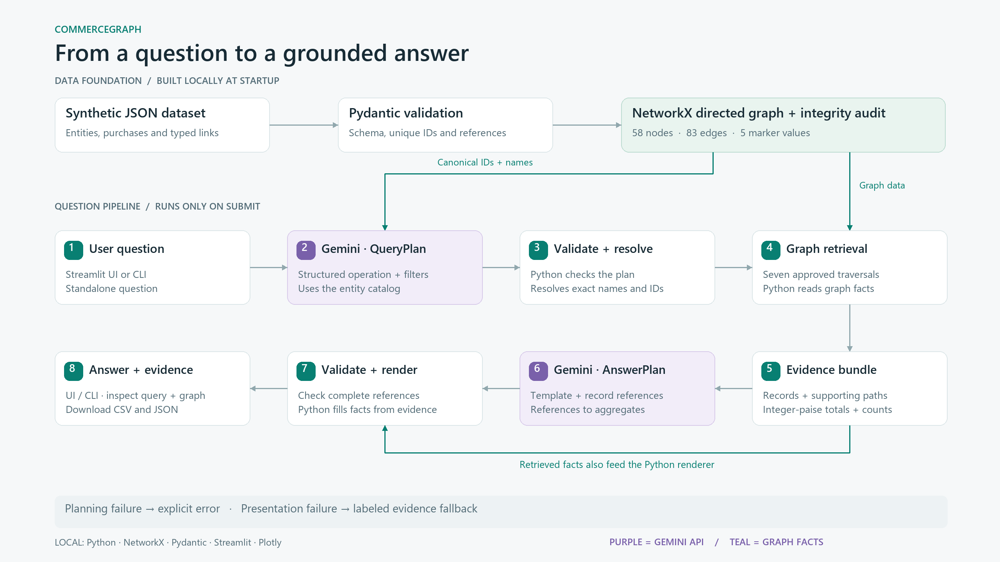
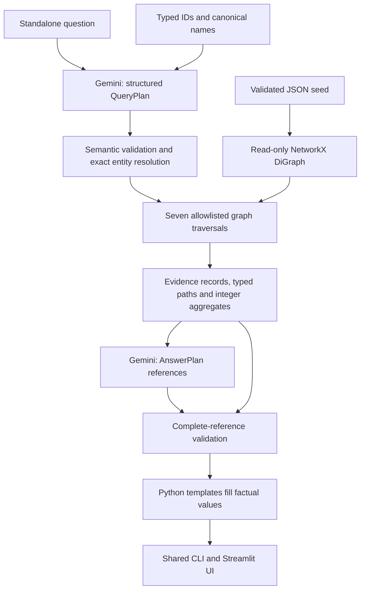

# Architecture

[Editable SVG diagram](diagrams/commercegraph-architecture.svg)

Source validation occurs before adding edges because NetworkX can implicitly
create endpoint nodes. Namespaced keys prevent cross-type collisions. A DiGraph
is sufficient for one relationship per ordered pair. Individual OrderItem nodes
preserve repeated purchase lines and historical prices. Incoming SUPPLIES edges
are traversed through predecessors; reverse edges are not stored.

The graph is rebuilt from JSON on application launch, frozen structurally, and
treated as read-only. Freeze does not make attribute dictionaries immutable.
Visualization and export copy values without changing the query graph. JSON is
the source of persistence; there is no database server or shared transaction state.

The planner gets entity catalogs, not all transaction facts. QueryPlan forbids
extra fields and rejects operation-incompatible parameters. Names are matched
exactly after whitespace normalization and case folding. IDs match exactly.
Ambiguous or absent entities never trigger nearest-name substitution.

Retrieval reads graph relationships and attributes, not the source JSON. Each
record has an application-assigned evidence ID. Evidence includes the nodes and
real directed edges needed to support its assertions. Distinct entities are
deduplicated before counting. Results are ordered by stable IDs.

Only the presentation plan is generated by the second LLM. It selects a permitted
template, the complete retrieved record set, and known aggregates. Python inserts
all names, prices, counts, statuses, and line totals. This constrains displayed
facts; it does not prove that Gemini understood every user's intent or that
source data represents real-world truth. The UI exposes interpreted filters.

If stage two fails, the same evidence is rendered with a labeled deterministic
fallback. If stage one fails, no query is fabricated. Missing keys do not cause
a switch to offline mode. Offline mode accepts exact predefined questions and
is explicitly labeled; it demonstrates traversal, not natural-language inference.

Streamlit executes inference only on a submitted form. Per-session services,
completed results, and history preserve outputs across view/filter changes.
Configuration changes are reread from local .env without exporting key values
into process environment or including them in result reports.

Graph-derived answer text is escaped before entering the UI's decorative HTML.
Plotly labels are HTML-escaped.
CSV cells that could be spreadsheet formulas are prefixed with an apostrophe.
Graph exports are JSON, not executable pickle objects. Provider exception strings
are not displayed or persisted because they may include credentials or URLs.
